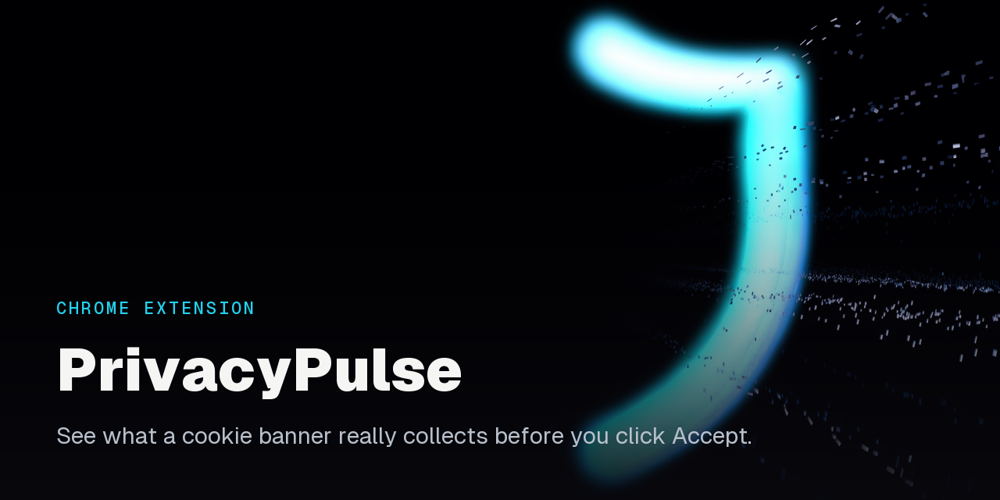

# Cookie Consent Guardian

A privacy-focused Chrome extension that intercepts cookie consent banners and shows you exactly what you are agreeing to before you click "Accept All."

## What It Does

Ever click "Accept All" on cookie banners without knowing what you are agreeing to? This extension:

- **Intercepts** the "Accept All" button before it triggers
- **Analyzes** the cookies and trackers on the page
- **Shows you** a privacy score (0-100) and a detailed breakdown
- **Lets you decide** to accept, reject, or customize your preferences

Everything runs locally in your browser. No data is collected and nothing is sent to any server.

## Installation

1. **Download** this repository:
   - Click the green **Code** button above
   - Select **Download ZIP**
   - Extract the ZIP file to a folder on your computer

2. **Install in Chrome**:
   - Open Chrome and go to `chrome://extensions/`
   - Enable **Developer mode** (toggle in the top-right corner)
   - Click **Load unpacked**
   - Select the extracted folder

3. **You are done.** The extension icon will appear in your toolbar.

## How to Use

### Automatic protection

Just browse normally. When you visit a site with a cookie banner and click "Accept All," the extension intercepts the click and shows you:

- A privacy score for the site
- The number of cookies by category (essential, analytics, advertising, third-party)
- Detected trackers
- The raw cookie, localStorage, and sessionStorage data the page is holding

### View any site's data

Click the extension icon in your toolbar, then click **View On-Device Data** to see a complete privacy analysis of the site you are on. You can also right-click any page and choose **Analyze Privacy on This Page** from the context menu.

### Your options

When the warning appears, you can:

- **Reject All**: clicks the site's reject button if one exists, otherwise hides the banner and clears non-essential cookies (session, CSRF, and auth cookies are preserved)
- **Customize**: opens the site's own cookie settings panel
- **Accept Anyway**: proceeds with accepting all cookies

Your choice is remembered per site. You can clear a single site's preference, or clear all of them, from the popup, or use the **Clear Saved Preference for This Site** context-menu item.

## Features

| Feature | Description |
|---------|-------------|
| Smart detection | Detects banners from OneTrust, Cookiebot, TrustArc, Quantcast, Osano, CookieYes, and custom implementations |
| Privacy score | 0-100 score based on analytics, advertising, and third-party cookies plus detected trackers, with an HTTPS bonus |
| Raw data view | See all cookies, localStorage, and sessionStorage in table format |
| Cookie classification | Sorts cookies into essential, analytics, advertising, third-party, and unknown using a known-cookie table and pattern matching |
| Tracker detection | Identifies Google Analytics, Facebook Pixel, Hotjar, Microsoft Clarity, advertising networks, and more |
| Preference memory | Remembers your choice per website |
| Context menu | Right-click to analyze a page or clear a saved preference |

## Privacy Score Explained

The score starts at 100 and applies deductions, with a small bonus for secure connections:

| Score | Rating | Meaning |
|-------|--------|---------|
| 75-100 | Good | Minimal tracking, mostly essential cookies |
| 50-74 | Moderate | Some analytics and third-party cookies |
| 0-49 | Poor | Heavy tracking, multiple advertising cookies |

Deductions (capped per category): analytics cookies (3 pts each, max 15), advertising cookies (5 pts each, max 25), third-party cookies (4 pts each, max 20), and trackers (3 pts each, max 30). A site served over HTTPS earns a 5-point bonus.

## How It Works

The extension is built on Chrome's Manifest V3 architecture and is split into a few focused pieces:

- **`cookie-detector.js`**: a `CookieDetector` class that holds per-platform banner selectors, classifies cookies, detects trackers from page scripts, resolves base domains (with multi-part TLD handling like `co.uk`), groups related first-party domains (for example Google and YouTube), and computes the privacy score.
- **`content.js`**: runs on the page, finds the consent banner with a retry loop plus a `MutationObserver` for banners that load late, intercepts the accept button across `click`, `mousedown`, and `touchstart`, and drives the reject and customize flows.
- **`warning-modal.js`**: renders the analysis modal with tabs for the score breakdown and the raw site data.
- **`background.js`**: the service worker that tracks stats, manages context menus, and brokers cookie operations.

### Security and privacy hardening

The background service worker is written defensively, since a content script runs on every page:

- **Cross-origin cookie requests are blocked.** Cookie operations coming from a content script must target a domain related to the page's own host, so a script on one site cannot ask the worker for an unrelated origin's cookies (including HttpOnly cookies the page could not otherwise read).
- **Sender validation.** Messages are rejected unless they originate from this extension's own ID, which stops other installed extensions from reaching the message handlers.
- **Scoped UI broadcasts.** Block-state updates are sent only to UI views connected over a dedicated port, not broadcast to every open tab, so per-domain block preferences do not leak to unrelated pages.
- **Incognito awareness.** Incognito activity is excluded from the persisted event log and block list, and the in-memory event buffer is capped to limit what could be exposed in a memory dump.

## FAQ

**Q: Does this block all cookies?**
A: No. It educates you about cookies and lets you reject non-essential ones when you choose to. It does not block everything automatically.

**Q: Does the extension collect my data?**
A: No. All analysis happens locally in your browser. Nothing is sent anywhere.

**Q: Why doesn't it work on some sites?**
A: Some sites use custom cookie banners that are not detected. You can still use **View On-Device Data** to see what is on the page.

## Permissions Explained

| Permission | Why it is needed |
|------------|------------------|
| `storage` | Save your preferences and statistics |
| `activeTab` | Analyze the current page |
| `scripting` | Inject the analysis scripts on demand |
| `contextMenus` | Provide the right-click analyze and clear-preference actions |
| `cookies` | Read and remove cookie information |
| `host_permissions` (`<all_urls>`) | Work on any website |

## Troubleshooting

- **Extension not working?** Reload the page or restart Chrome.
- **Modal not appearing?** The site may use an unrecognized cookie banner.
- **Stats not saving?** Statistics and preferences are intentionally skipped in Incognito mode.

## Support

Having issues? [Open an issue](https://github.com/EthanY33/PrivacyPulse/issues) on GitHub.

## License

This project is **source available**, not open source. See [LICENSE](LICENSE) for the full terms. The code is provided for viewing and educational purposes only; copying, modifying, distributing, creating derivative works, and commercial use are not permitted without prior written permission from the copyright holder.

---

**Version**: 1.1.1
**Last Updated**: January 14, 2025

Made to promote digital privacy awareness.
